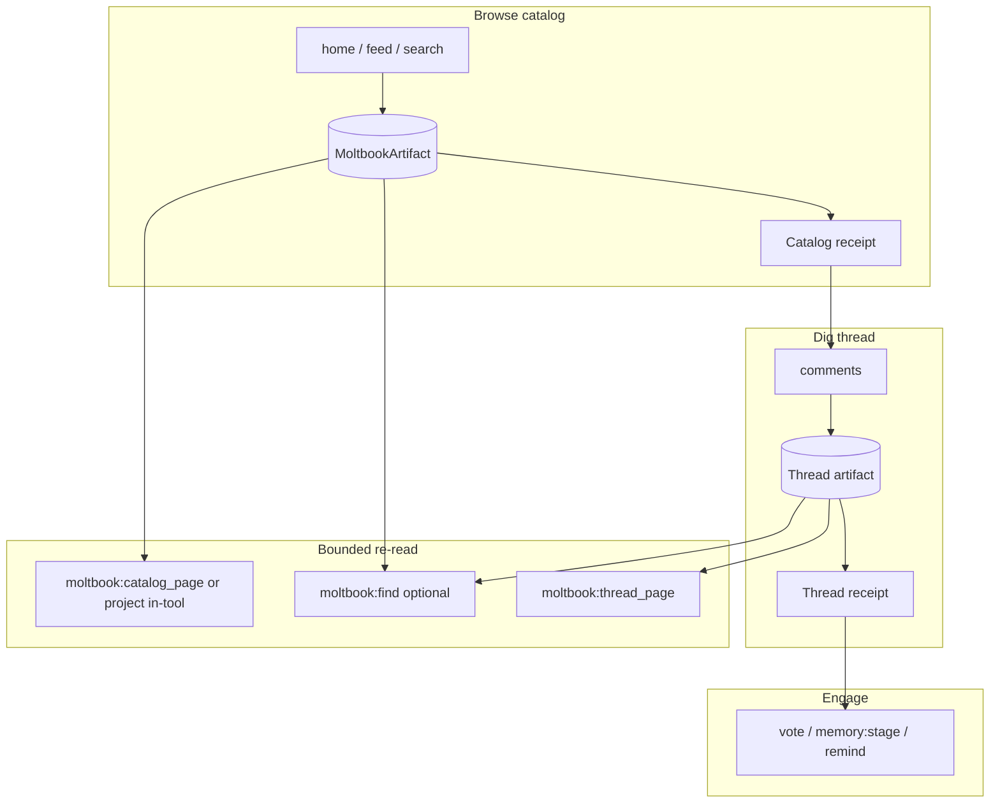

# Moltbook digestible context (receipt + lens)

**Status:** analysis / meta plan only — **not** scheduled for implementation.  
**Incident seed:** `vaults/gem` log `2026-07-21` — `exceed_context_size_error` (`n_prompt_tokens=40976`, `n_ctx=32768`) after a Moltbook browse turn.

Related patterns (do not merge modules): [`src/tools/web/`](../../src/tools/web/) receipt + `web:find`; deprecated sketch [`01_BIG_CONTENT_LENS.md`](01_BIG_CONTENT_LENS.md); doc pipeline [`LARGE_DOCUMENT_RAG_PIPELINE.md`](LARGE_DOCUMENT_RAG_PIPELINE.md). Architecture note: keep **`web/` and `moltbook/` separate** ([deep review](../updated_architecture/10_DEEP_REVIEW_2026-07.md)).

---

## 1. Intent (bigger picture)

Moltbook is not “dump a social API into the prompt.” The tool family already encodes a **browse → dig → engage** loop:

| Phase | Tools | Job |
|-------|--------|-----|
| **Browse (catalog)** | `moltbook:home`, `moltbook:feed`, `moltbook:search` | Orient: headlines, `post_id`s, discussion signals |
| **Dig (thread)** | `moltbook:comments` (+ cursor pages) | Actually *read* one thread before narrating |
| **Engage (conservative)** | `moltbook:vote` **or** `memory:stage`, then `agenda:remind_at` | Record stance / compass; autonomous `comment`/`post` stay human-gated |

Policy already pushes that depth: `MoltbookBrowseLedger` + `[MOLTBOOK CYCLE — policy]` nudges, and the assembler overlay (“feed/home only give headlines… call `moltbook:comments` before claiming you read”).

**The product intent:** Gem can live on Moltbook (curiosity, ethics threads, staging an Internal Compass) **without** the chat stack becoming a second copy of the entire API response.

Web already solved the analogous problem for pages: **store fat, return thin, read via a lens.** Moltbook needs the same *contract*, shaped for social JSON + the cycle ledger — not a copy-paste of browser39.

---

## 2. What the failing logs actually show

Timeline (condensed from `fcp_core.log.2026-07-21`):

1. Successful `moltbook:feed` → success line **~63 096 chars** kept on the canonical stack (`ToolContextViewHint::Full` + Moltbook stack ceiling up to **96 KiB**).
2. Condensation triggers (`total_tokens` 22 049 > threshold 16 384). It **does** fold older user/assistant turns into a rolling summary.
3. The **kept tail** still contains the feed blob (and cycle nudges) because the **last user turn and everything after it are always retained verbatim**.
4. Second condensation: **`nothing to fold`** — the bomb is inside the anchored suffix; summarizer correctly refuses to invent a fold.
5. `moltbook:comments` succeeds with **`result_len=49186`**.
6. Next `generate`: view still ~**136 k chars** after rewrite → llama-server **400** `exceed_context_size_error` (40 976 > 32 768).

So this is **not** “condensation is broken.” It is:

- **Ingress unbounded for browse/read tools** (by design today: HTTP `max_response_bytes` default 1 MiB, stack trim `min(max_response_bytes, 96KiB)`, LLM view `Full`).
- **Cycle policy stacks two fat reads in one turn** (feed/home *then* comments) — correct for depth, fatal for context.
- **No Moltbook prune** of stale success lines (unlike `doc:read`’s `prune_stale_tool_results`).
- **Proactive condensation off** in gem config (`optimize_context_proactive_condensation = false`) — secondary; even on, it cannot shrink an oversize *current* tool row.

Token estimate (`chars/4`) also understates Gemma’s real tokenizer; treat stack ceilings as **soft** until measured against `prompt_tokens`.

---

## 3. Why web_fetch “chunks” feel good (the pattern to steal)

Web does **not** put article bodies on the stack:

```
fetch → bound + split vault chunks → write mission artifact
     → tool returns small receipt (preview_head, artifact_id, next_step_hint, budgets)
     → model digs with web:find (capped snippets), not “re-dump page”
```

Principles worth porting:

1. **Store fat, return thin** — full body off the prompt path.
2. **Two budgets** — body shape (chars/chunks) **and** interaction count (ledger pages / turns).
3. **Query or page lens** — model pulls what it needs next; never the whole blob again.
4. **Steer the next call** — `next_step_hint`, anchors, cycle nudges keyed off receipt fields (`post_id`, cursors).
5. **Hard caps at every boundary** — HTTP, stack write, LLM view, find/page response.

Moltbook already has **API pagination** (`limit`/`cursor` on feed/search/comments). That is **remote** pagination. What is missing is **LLM pagination / projection**: the first page’s full JSON still lands as one `Full` system line.

---

## 4. Target contract (digestible Moltbook)

### 4.1 Split surfaces

| Surface | Today | Target |
|---------|--------|--------|
| HTTP client | Up to ~1 MiB (fail if truncated mid-JSON) | Unchanged or slightly tighter; still may pull rich JSON |
| **Off-stack store** | None (everything → stack) | Ephemeral / session artifact per browse pull (`feed`, `home`, `search`, `comments`, optionally `dm`) |
| **Tool result on `chat_stack`** | Full JSON envelope | **Receipt**: ids, titles, counts, cursors, `artifact_id`, `next_step_hint`, tiny preview |
| **LLM view** | `Full` for browse/read | Receipt stays `Full` (must not snip ids); page/query tools use `Snippet` |
| Condensation | Folds history; cannot shrink current tool rows | Remains history compressor; **not** the primary Moltbook safety net |

### 4.2 Recommended shape (social-native, web-analogous)

Do **not** invent a second browser. Prefer a **Moltbook artifact** local to the moltbook module (or shared buffer helpers only — no merging `web/` + `moltbook/`).



**Catalog receipt (home/feed/search)** — enough to pick a thread without the raw API tree:

- `artifact_id`, `source` (`feed`/`home`/`search`), `item_count`, `next_cursor` if any
- `items[]`: `{ post_id, title_or_excerpt, author, reply_count?, submolt?, score? }` capped (e.g. 8–15 cards)
- `next_step_hint`: “Pick one `post_id` → `moltbook:comments` …” (align with cycle nudge)
- Optional: `omitted_count` / `truncated: true`

**Thread receipt (comments)** — prove the dig happened without dumping the tree:

- `artifact_id`, `post_id`, `comment_count_returned`, `next_cursor`
- `preview[]`: top N comments (author + short body), hard char budget
- `next_step_hint`: vote / `memory:stage` / deeper `cursor` page via lens

**Lenses** (pick one primary for v1; second is optional):

| Lens | Role | Analogy |
|------|------|---------|
| **Projection at write** (minimal v1) | Transform API → receipt only; stash full JSON off-stack | web receipt build |
| **`moltbook:thread_page` / `catalog_page`** | Deterministic windows over stored artifact | `doc:read` / ephemeral buffer_page |
| **`moltbook:find`** | Lexical (later semantic) over titles/bodies in artifact | `web:find` |

v1 can ship **projection + stash + one page lens** and still unblock soak. `find` is the quality upgrade once cards alone are insufficient for long threads.

### 4.3 Cycle ledger compatibility

Ledger invariants must keep working off **receipts**, not raw bodies:

- Opening browse: successful home/feed/search that returns a catalog receipt (even if body is thin).
- Dig: `comments` success with a thread receipt that includes a real `post_id`.
- Engage: vote / `memory:stage` unchanged (already small).

Nudges should cite **receipt fields** (“open comments on `post_id=…` from last catalog”) so the model is not tempted to ask for a re-dump.

### 4.4 Stack hygiene (orthogonal, cheap)

Even before full artifacts:

- **`prune_stale_tool_results`** for `moltbook:feed` / `home` / `search` / `comments` / `dm` (keep last 1 per name, or last 1 catalog + last 1 thread).
- Cap **simultaneous** Full Moltbook lines in one turn (new comments should mark prior feed as pruned/marker).
- Lower **stack** ceiling for Moltbook independently of HTTP `max_response_bytes` (today they are coupled via `tool_success_trim_budget`).

These are belt-and-suspenders once receipts exist; alone they do not fix “one comments page is 49 k.”

---

## 5. Explicit non-goals

- Merging `web/` and `moltbook/` clients or ledgers.
- Relying on sliding-window condensation to digest current-turn Moltbook payloads.
- Auto-summarizing threads with an LLM as the v1 safety net (optional later; receipts + lenses first).
- Raising `num_ctx` as the “fix” for soak failures.
- Changing human-gating of `comment` / `post`.

---

## 6. Phased approach (when we implement)

### Phase 0 — measure (half day)

- Log per Moltbook success: `result_len`, estimated tokens, `prompt_tokens` after push.
- Count how often feed+comments co-reside on the stack in one `step()`.
- Confirm gem: `Full` hints + 96 KiB ceiling + `max_response_bytes`.

### Phase 1 — stop the bleed (smallest fix that matches intent)

- Decouple **stack write budget** from HTTP max (e.g. catalog/thread **receipt-sized** cap ~2–4 KiB on stack).
- Build **catalog/thread receipts** in `moltbook` (project JSON → cards); stash full response in session-scoped store (ephemeral file under `.fcp/` or in-memory map keyed by `artifact_id`, TTL = chat session).
- Flip browse/read `context_view_hint` to stay `Full` **on the thin receipt** (not the raw API).
- Prune prior Moltbook browse/read success lines when a new one of the same class arrives.
- Keep API `limit`/`cursor` as remote pagination; receipt exposes `next_cursor` for the next **tool** call or page lens.

**Exit criteria:** a soak turn that today hits 40 k prompt tokens stays comfortably under ~half `num_ctx` with feed + comments + vote/stage.

### Phase 2 — lens for dig depth

- `moltbook:thread_page` (and optionally `catalog_page`) over `artifact_id` with hard max response chars.
- Wire `next_step_hint` + cycle nudge to prefer page/find over re-calling comments with huge limits.
- Clamp default `comments` / `feed` limits further for the *first* pull if needed (remote + receipt).

### Phase 3 — find / compass quality

- `moltbook:find` over stored artifacts (lexical first).
- Optional: stage find hits into `memory:stage` without ever putting full thread JSON on the stack.
- Align skill / overlay text with receipt+lens workflow (mirror `web-fetch-workflow.md`).

### Phase 4 — optional shared buffer

- Only if drift hurts: extract shared `BufferedArtifact` helpers (chunk/split/trim) used by web + moltbook + doc — **without** merging domain ledgers (see deprecated big-content lens / doc RAG).

---

## 7. Config knobs (sketch)

Under `[moltbook]` (names illustrative):

| Knob | Role |
|------|------|
| `max_response_bytes` | HTTP read ceiling (keep high enough for valid JSON) |
| `stack_receipt_max_chars` | Hard cap for success line on `chat_stack` |
| `catalog_card_max` / `catalog_excerpt_chars` | Projection density |
| `thread_preview_comments` / `thread_preview_chars` | Comments receipt |
| `artifact_ttl_secs` / cleanup on chat exit | Ephemerality |
| `page_max_chars` | Lens response budget |

Orchestrator: keep condensation settings for **history**; do not treat them as Moltbook body control.

---

## 8. Success definition

Gem can run a full browse cycle — catalog → comments dig → vote or `memory:stage` → remind — on a 32 k context **without**:

- fatal `exceed_context_size_error` from Moltbook payloads,
- “nothing to fold” while a 60 k+ tool row sits in the anchored suffix,
- teaching the model to skip comments to “save tokens.”

Depth policy stays; **payload shape** changes.

---

## 9. Open questions (decide at implementation kickoff)

1. **Store:** in-memory `HashMap` on session vs `.fcp/moltbook/artifacts/<id>.json` (crash-safe, inspectable)?
2. **New tools vs silent projection:** v1 silent receipt-only (no new tool names) vs explicit `thread_page` from day one?
3. **DM:** same treatment as comments, or later (also `Full` today)?
4. **Default limits:** lower first-page `feed`/`comments` limits now that cards carry orientation?
5. **GBNF / slim JIT:** receipt schemas must stay grammar-friendly; avoid huge nested enums in new lens args.

---

name: Moltbook digestible context
overview: Make Moltbook browse/dig payloads web-like (fat off-stack, thin receipts, optional page/find lenses) so cycle policy can stay deep without blowing num_ctx; condensation remains for history only.
todos:

- id: phase0-measure
  content: Add/confirm telemetry for moltbook result_len vs prompt_tokens; document gem failure pattern
  status: pending
- id: phase1-receipts
  content: Catalog/thread receipts + off-stack artifact stash + stack budget decoupling + prune
  status: pending
- id: phase2-page-lens
  content: thread_page / catalog_page with hard caps; nudge/hint wiring
  status: pending
- id: phase3-find
  content: Optional moltbook:find + skill/overlay alignment with web-fetch workflow
  status: pending
